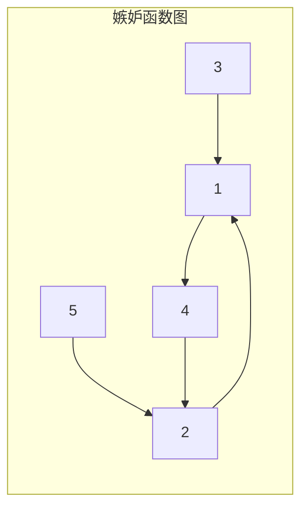
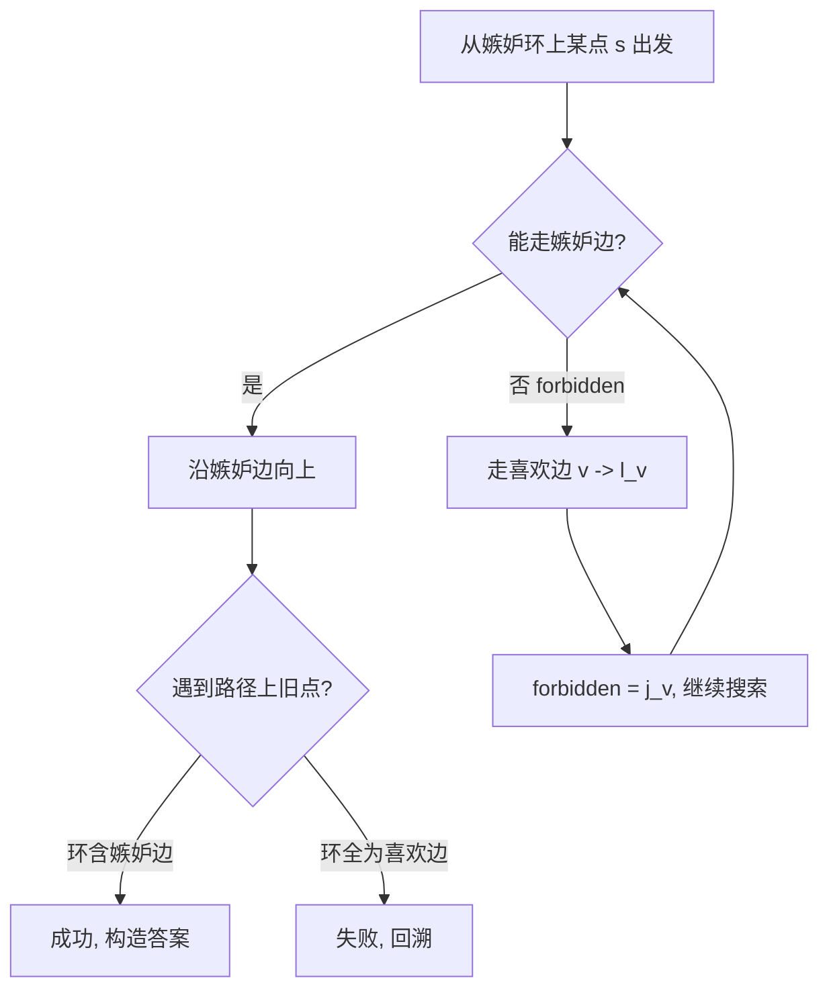

# P15470 [ICPC 2024 WF] Kindergarten 幼儿园 题解

## 题意简述

有 $n$ 个孩子，编号 $1 \sim n$，编号越小越酷。每个孩子 $i$ 有两个关系：

- **嫉妒对象** $j_i$：若 $j_i$ 在 $i$ 之后进入房间，$i$ 可能捣乱；
- **喜欢对象** $l_i$：若 $l_i$ 在 $i$ 之后、$j_i$ 之前进入房间，$i$ 会克制自己。

形式化地说，若 $A$ 嫉妒 $B$、喜欢 $C$，则当

$$
\text{pos}(B) > \text{pos}(A) \quad \land \quad \big(\text{pos}(C) < \text{pos}(A) \;\lor\; \text{pos}(C) > \text{pos}(B)\big)
$$

时，$A$ 可能留下惊喜。

要求构造一个 $1 \sim n$ 的排列，使所有孩子都不会捣乱；若不存在则输出 `impossible`。

**约束**：$3 \le n \le 2 \times 10^5$，且对 $i > 1$ 有 $j_i < i$（$1$ 号孩子除外）。

---

## 核心转化

对每个 $i$，只有两种安全模式：

| 模式 | 含义 | 等价约束 |
|------|------|----------|
| **普通** | $j_i$ 在 $i$ 之前进入 | $j_i \to i$ |
| **切换** | $i < l_i < j_i$ | $i \to l_i \to j_i$ |

任意合法排列，都对应一种为每个孩子选择「普通 / 切换」的方式；反过来，若这些有向约束构成 DAG，其拓扑序就是答案。

因此问题变成：

> 能否为每个孩子选择一种模式，使得最终约束图无环？

---

## 嫉妒图的结构

把每个孩子 $i$ 连向 $j_i$，得到函数图 $i \to j_i$。

由于 $j_i < i$（$i > 1$），每个点都指向更小的编号，最终一定会走到 $1$。因此整张图是**一棵以 $1$ 为根的反树，外加一条包含 $1$ 的环**。



若全部选「普通」模式，约束就是 $j_i \to i$，恰好是这个函数图反向后的边，其中包含唯一环，因此**至少环上有一个点必须切换**。

---

## 切换一个点会发生什么？

设 $x$ 切换，则删除约束 $j_x \to x$，新增：

$$
x \to l_x,\quad l_x \to j_x
$$

从 $l_x$ 出发沿嫉妒边 $v \to j_v$ 向上走：

- 若走到 $j_x$，说明会形成环，必须继续切换路径上的某个点；
- 若走到某个已在搜索路径中的点，则找到了一个「混合环」。

这就是递归修复冲突的过程。

---

## 混合环搜索

在嫉妒图和喜欢边构成的混合图上 DFS，边有两种：

1. **嫉妒边**：$v \to j_v$
2. **喜欢边**：$v \to l_v$

### 搜索状态

从嫉妒环上的每个点 $s$ 出发，调用 `search(s, j_s, 0)`，含义为：

- `forbidden = j_s`：走喜欢边 $v \to l_v$ 后，后续嫉妒链**不能进入** $j_v$；
- `last_jealous`：当前路径上最近一次走嫉妒边后的位置。

### 转移规则

对每个点 $v$：

1. **优先走嫉妒边** $v \to j_v$（若 $j_v \neq \text{forbidden}$）；
2. 否则走喜欢边 $v \to l_v$，并把 `forbidden` 更新为 $j_v$。

### 何时找到合法环？

当 DFS 再次遇到路径上的点 $v$ 时：

- 若 `pos[v] < last_jealous`，说明新找到的环中**至少包含一条嫉妒边**；
- 若环中全是喜欢边，则对应约束 $v \to l_v$ 本身成环，必须拒绝。



若嫉妒环上所有起点都失败，则输出 `impossible`。

**实现注意**：$n$ 可达 $2 \times 10^5$，必须用**显式栈**模拟 DFS，避免递归爆栈。

---

## 由混合环构造排列

设搜索得到路径 `path`，其中 `loop_start` 为环的起点。

### 第一步：分离前缀

`path` 可能是「若干嫉妒边 + 一个环」。把进入环之前的嫉妒前缀单独保留，环内其余部分用于构造。

### 第二步：旋转环

若环的闭合边是喜欢边，则旋转环，使闭合边变为嫉妒边。这样每个嫉妒链都能整体反转输出。

### 第三步：输出规则

1. 将 `path` 中每一段**极大嫉妒链** $x_0 \to x_1 \to \cdots \to x_k$ **倒序输出** $x_k, \ldots, x_0$；
2. 这样链上每个 $x_i$ 的嫉妒对象 $j_{x_i} = x_{i-1}$ 都在其前面，满足普通模式；
3. 在喜欢边 $x \to l_x$ 处，搜索不变量保证 $x < l_x < j_x$；
4. 对尚未输出的点：按 BFS 顺序，依次输出所有「以某点为嫉妒对象」的孩子（即嫉妒树上的剩余子树），每个都在其嫉妒对象之后，自动安全。

### 样例 1 说明

输入：

```
4
4 2
1 4
2 4
2 1
```

嫉妒图：$1 \to 4 \to 2 \to 1$（环），$3 \to 1$。

全部普通模式要求 $1 < 2 < 3 < 4$，但 $1$ 嫉妒 $4$，而 $4$ 在 $1$ 后面，不安全。必须切换环上某个点。最终可输出 `1 2 3 4`。

### 样例 2 说明

输入：

```
4
2 3
1 4
2 1
1 2
```

对嫉妒环上每个起点搜索均失败，因此 `impossible`。

---

## 正确性直觉

1. **必要性**：任意合法排列都对应一种模式选择；若全部普通则嫉妒环无法打破，故环上必有人切换。
2. **搜索完备性**：切换 $x$ 后，唯一新的危险来自 $l_x \to j_x$ 这条链；DFS 枚举了链上第一个必须切换的点，覆盖了所有可能修复方式。
3. **构造充分性**：反转嫉妒链保证普通约束；喜欢边处由搜索不变量保证 $i < l_i < j_i$；BFS 补全的嫉妒子树点都在其父嫉妒对象之后。

---

## 复杂度

| 项目 | 复杂度 |
|------|--------|
| 时间 | $O(n)$ |
| 空间 | $O(n)$ |

每个点在一次失败的根搜索中最多被「尝试普通」和「被迫切换」各一次；嫉妒环长度总和为 $O(n)$，因此总时间为线性。

---

## 实现要点

1. 预处理 `jealous_children[v]`：所有满足 $j_i = v$ 的 $i$，用于最后 BFS 补全；
2. DFS 必须**先嫉妒、后喜欢**；
3. `path_pos` 只记录当前 DFS 路径，回溯时清零；
4. 找到环后注意 `prefix_end` 与 `rotate`，保证闭合边是嫉妒边；
5. 输出时跳过环内部尚未处理的前缀段 `[prefix_end, loop_start)`。

完整代码见 [`P15470.cpp`](P15470.cpp)。

---

## 参考

- [ICPC World Finals 2024 题面](https://icpc.global/worldfinals/problems/2024-ICPC-World-Finals/icpc2024.pdf)
- [Bruce Merry 题解思路](http://blog.brucemerry.org.za/2025/01/icpc-world-finals-2024-solutions.html)
