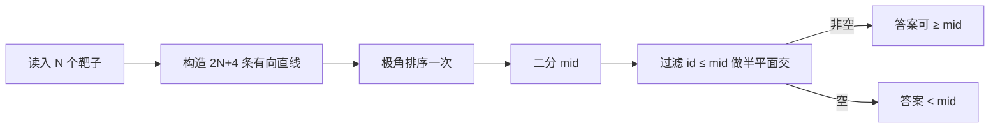

# P3222 [HNOI2012] 射箭 题解

## 题意简述

从原点 $(0,0)$ 射出一条穿过第一象限的抛物线（角度严格介于 $0^\circ$ 与 $90^\circ$ 之间，无空气阻力）。第 $i$ 关新增一根竖直线段靶子：横坐标 $x_i$，纵坐标区间 $[y_{i1},y_{i2}]$。过关 $K$ 要求**同一条**抛物线同时穿过前 $K$ 个靶子（端点算击中）。求最大通关数。

**约束**：$N \le 10^5$，所有坐标 $\le 10^9$。

---

## 建模

无空气阻力、从原点射出，轨迹可写成

$$
y = ax^2 + bx,\qquad a < 0,\ b > 0.
$$

（开口向下、初速度指向第一象限。）

靶子 $(x,[y_1,y_2])$ 被击中当且仅当

$$
y_1 \le ax^2 + bx \le y_2.
$$

两边除以 $x > 0$：

$$
\frac{y_1}{x} \le ax + b \le \frac{y_2}{x},
$$

整理成关于 $(a,b)$ 的线性不等式：

$$
\begin{aligned}
b &\ge -xa + \frac{y_1}{x}, \\
b &\le -xa + \frac{y_2}{x}.
\end{aligned}
$$

每个靶子对应 $(a,b)$ 平面上的**两个半平面**。再加上 $a < 0$、$b > 0$，问题变成：是否存在一点落在所有这些半平面的交集里。

---

## 二分答案

若前 $K$ 个靶子可同时击中，则前 $K-1$ 个显然也可。答案关于前缀长度单调，故二分通关数 `mid`，再判断「前 `mid` 个靶子对应的半平面交是否非空」。

单关靶子不贴坐标轴，第一关恒可行，二分下界可取 $1$。

---

## 半平面交

用有向直线表示半平面，约定**左侧**为可行域。对靶子 $i$：

| 约束 | 有向直线（从 $P$ 到 $Q$） |
|------|---------------------------|
| $b \ge -xa + y_1/x$ | $(0,\ y_1/x) \to (1,\ y_1/x - x)$（从左到右，左侧在上方） |
| $b \le -xa + y_2/x$ | $(1,\ y_2/x - x) \to (0,\ y_2/x)$（从右到左，左侧在下方） |

再加一个大开盒裁剪到 $a \in (-\infty,0)$、$b \in (0,+\infty)$（边界用 $\varepsilon$ 避开 $a=0$ 或 $b=0$）：

$$
(-\mathrm{INF},\varepsilon)\to(-\varepsilon,\varepsilon)\to(-\varepsilon,\mathrm{INF})\to(-\mathrm{INF},\mathrm{INF})\to(-\mathrm{INF},\varepsilon).
$$

标准半平面交流程：

1. 按方向向量极角排序；
2. 双端队列维护当前凸交的边界直线，以及相邻直线交点；
3. 加入新直线时**先弹队尾、再弹队首**（交点落在新直线右侧则弹出）；
4. 平行直线只保留更紧的那条；
5. 扫完后再用队首直线检查队尾交点；
6. 队列里至少剩 $3$ 条边则交非空（实现里用 `t - h > 1`）。

点**恰好在边界上**要保留（端点算击中），判断「在右侧」时用严格不等式 `< -\varepsilon`。

---

## 一次排序多次查询

瓶颈在极角排序。把 $2N$ 条靶子半平面与 $4$ 条边界半平面**预先排好序**，边界编号记为 $0$。二分 `check(mid)` 时扫一遍，跳过编号 $> \mathrm{mid}$ 的直线即可，每次 check 为 $O(N)$。

---

## 复杂度与精度

| 项目 | 量级 |
|------|------|
| 半平面条数 | $O(N)$ |
| 预处理排序 | $O(N\log N)$ |
| 二分次数 | $O(\log N)$ |
| 单次 check | $O(N)$ |
| 总计 | $O(N\log N)$ |

坐标到 $10^9$，建议：

- `INF` 取到 $10^{11}$ 量级以上；
- `EPS` 取到 $10^{-11}$ 量级以下；
- 可用 `long double`；
- 平行判定不要直接比 `atan2` 是否相等，用极角差绝对值与 `EPS` 比较更稳。

---

## 实现要点

1. 抛物线参数必须 $a < 0$、$b > 0$，边界盒不要贴到坐标轴。
2. 加入直线顺序：先弹尾、再弹头；扫完再处理「队首相对队尾」的闭合检查。
3. 退化交于一点时仍算可行——`right` 判断不要把「在线上」当成「在右侧」。
4. 边界半平面编号为 $0$，始终参与每一次 check。

完整代码见 [`P3222.cpp`](P3222.cpp)。

---

## 参考

- [洛谷 P3222](https://www.luogu.com.cn/problem/P3222)
- HNOI2012 · 射箭
